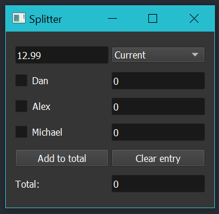
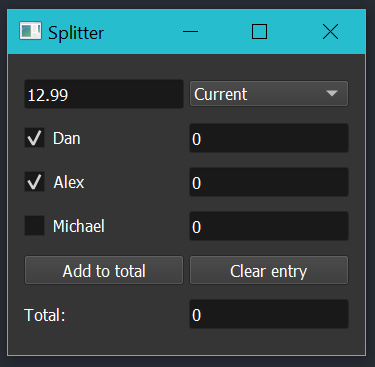
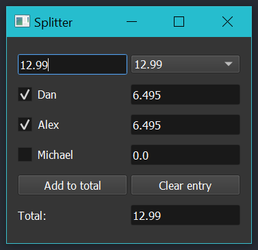
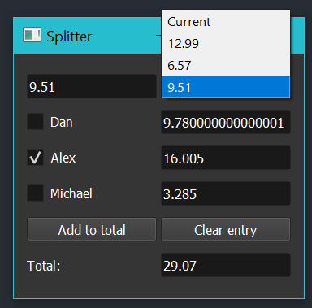

# Price-Splitter
A small utility written with Python and a Qt-based GUI for splitting prices between multiple people, and summing the share of each person.

## Installing

```powershell
pip install -r requirements
```

## How to run

```powershell
python splitter.py Person1 Person2 ... PersonN
```

Pass the names of all participants as arguments.

## Usage

1. Enter the product price in the top box.
   
2. Select the participants.
   

3. Click `Add to total`
   
   The share of each person should be reflected on the right.
   The total cost is shown at the bottom.

### Deleting an entry

After entering multiple entries suppose you want to delete an entry due to a mistake.

1. Click the dropdown menu on the right.
   

2. Select the entry.
3. Click `Clear entry`.
4. The next entry will be loaded.

You can select `Current` from the dropdown to show the current state (total price, and shares).
